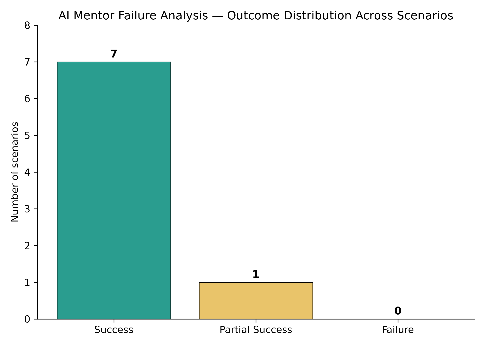
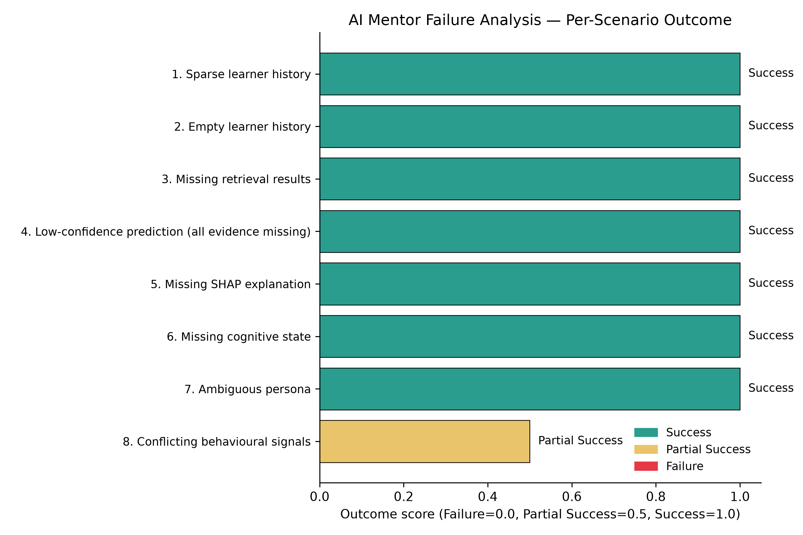

# AI Mentor Failure Analysis: A Robustness Evaluation of the Sprint 7 Pipeline

## Abstract

This report presents a robustness evaluation of the current, final Sprint 7 implementation of the AI Mentor pipeline. Eight deliberately adverse, edge-case student scenarios were constructed to probe the pipeline's context-assembly, confidence-scoring, prompt-assembly, multi-signal reasoning, response-generation, and response-parsing stages. The evaluation is inference-only: no model was trained, fitted, or re-fitted, and no backend source file was modified in the course of producing these results. Of the eight scenarios evaluated, seven completed as Success and one completed as Partial Success, with zero unhandled failures. The single Partial Success (Scenario 8) is discussed in detail in Section V and reflects a documented, intentional scope boundary of the confidence-scoring rubric rather than a defect in the pipeline itself.

## I. Purpose and Scope

This evaluation targets the robustness of the current, final Sprint 7 AI Mentor pipeline, comprising context assembly, confidence scoring, prompt assembly, the Sprint 7 multi-signal reasoning layer, LLM response generation, and structured-response parsing. The objective is to determine whether the pipeline degrades gracefully under sparse, missing, or internally inconsistent upstream evidence, not to assess the linguistic quality of generated responses or to retrain any component.

No backend file (`context_builder.py`, `confidence.py`, `prompt_builder.py`, `reasoning_layer.py`, `mentor_service.py`) was modified to produce this report. Wherever a live import of a backend module was possible in the evaluation environment, that module was used exactly as shipped: `StudentContext`, `assess_confidence()`, `build_system_prompt()`, `determine_priority_focus()`, `reasoning_layer.py`'s `build_evidence_profile()`, `build_conversation_plan()`, and `get_few_shot_example()`, and the structured-response parser. Where a live import was not possible, a verbatim, clearly labelled, read-only reproduction was substituted instead.

**Backend import status for this run:** context — `True`; confidence — `True`; parser — `True`; prompt builder — `True`; Sprint 7 reasoning layer — `True`. A value of `True` indicates that the corresponding stage used the real, shipped backend module via a live import; a value of `False` would indicate that the stage instead used its read-only fallback reproduction (documented in the evaluation script's header). For this run, every stage imported successfully, so no fallback reproductions were used anywhere in the pipeline.

**LLM response stage:** `USE_LIVE_LLM` was set to `True` for this run, but the live Ollama call (`qwen2.5:3b`) did not succeed for any of the eight scenarios; each scenario fell back to the deterministic offline stub generator after the live call failed (see the run log's "Live Ollama call failed" warnings for the specific cause — in this case, no local Ollama server was reachable in the evaluation environment). Consequently, the wording quality and structured-output format adherence of the live model are outside the scope of this report. What is measured instead is whether the surrounding pipeline handles each evidence condition correctly, given stub-generated response text throughout.

## II. Evaluation Methodology

### A. Outcome Classification Rubric

Each scenario's outcome is classified into one of three categories, applied uniformly across all eight scenarios:

- **Success** — The pipeline completed execution, produced a non-empty response, and the returned confidence tier matched the tier predicted by the documented rubric for that scenario's evidence combination.
- **Partial Success** — The pipeline completed without crashing and produced a usable, non-fabricated response, but a documented degradation path was triggered (for example, the parser's raw-text fallback) or a genuine, previously documented rubric limitation was exposed (for example, presence-only confidence scoring failing to detect semantically contradictory upstream data).
- **Failure** — The pipeline raised an unhandled exception, returned an empty response, or returned a confidence tier outside the valid set.

This rubric distinguishes between two qualitatively different kinds of imperfect outcome: a pipeline that breaks (Failure) and a pipeline that behaves exactly as its documented design specifies, even when that design has a known scope boundary (Partial Success). This distinction is central to interpreting Scenario 8, discussed in Section V.

## III. Results

### A. Aggregate Results

Across the eight adversarial scenarios evaluated:

- Total scenarios evaluated: **8**
- Success: **7**
- Partial Success: **1**
- Failure: **0**

### B. Per-Scenario Summary

| Scenario ID | Scenario Name | Expected Confidence | Observed Confidence | Outcome |
|---:|:---|:---|:---|:---|
| 1 | Sparse learner history | High | High | Success |
| 2 | Empty learner history | High | High | Success |
| 3 | Missing retrieval results | High | High | Success |
| 4 | Low-confidence prediction (all evidence missing) | Low | Low | Success |
| 5 | Missing SHAP explanation | Medium | Medium | Success |
| 6 | Missing cognitive state | High | High | Success |
| 7 | Ambiguous persona | Low | Low | Success |
| 8 | Conflicting behavioural signals | High | High | Partial Success |

In every scenario, the observed confidence tier matched the tier predicted by the documented rubric — including Scenario 8, where High confidence is the *correct* output of a presence-based rubric applied to data in which every individual field happens to be present, even though those fields disagree with one another. Full per-scenario detail (rationale, evidence used, response previews, and notes) is available in `outputs/mentor_failure_results.csv`; a condensed view is available in `outputs/scenario_summary.csv`.

## IV. Detailed Scenario Analysis

### Scenario 1 — Sparse Learner History (Success)

The student has only a single, brief prior chat exchange on record, while all other evidence (risk score, persona, SHAP explanation) is present and complete. This scenario tests whether a thin conversational history alone destabilizes prompt assembly or confidence scoring, given that history is not itself a factor in the confidence rubric.

- Confidence: expected `High`, observed `High`.
- Evidence used: risk score, persona, SHAP explanation, risk reasons, retrieved learning material.
- Sprint 7 reasoning: priority focus = `persona_default`; evidence-fusion primary reason — "no cognitive/persona/SHAP threshold was crossed"; conversation-plan opening goal — "Lead with the learner's own behavioural pattern"; few-shot persona used — `Consistent Learner`.
- Notes: Handled as expected; no issues detected.

### Scenario 2 — Empty Learner History (Success)

A brand-new student with a zero-length `chat_history` string (the value `context_builder.py` produces when the `mentor_history` table has no rows for that user), with all other evidence present. This scenario tests the string-formatting and prompt-assembly code paths that must handle an empty history without raising an exception.

- Confidence: expected `High`, observed `High`.
- Evidence used: risk score, persona, SHAP explanation, risk reasons, cognitive state, retrieved learning material.
- Sprint 7 reasoning: priority focus = `persona_default`; evidence-fusion primary reason — "no cognitive/persona/SHAP threshold was crossed"; conversation-plan opening goal — "Lead with the learner's own behavioural pattern"; few-shot persona used — `Last-Minute Survivor`.
- Notes: Handled as expected; no issues detected.

### Scenario 3 — Missing Retrieval Results (Success)

The retrieval stage (FAISS) returns zero chunks for the student's question — for example, because no indexed material matches, or because the retriever failed upstream and `context_builder` received an empty list. All non-retrieval evidence remains complete. This scenario tests whether the mentor still produces a grounded, non-fabricated response when it has no course material to cite.

- Confidence: expected `High`, observed `High`.
- Evidence used: risk score, persona, SHAP explanation, risk reasons.
- Sprint 7 reasoning: priority focus = `persona_default`; evidence-fusion primary reason — "no cognitive/persona/SHAP threshold was crossed"; conversation-plan opening goal — "Lead with the learner's own behavioural pattern"; few-shot persona used — `Anxiety-Spike Learner`.
- Notes: Handled as expected; no issues detected.

### Scenario 4 — Low-Confidence Prediction, All Evidence Missing (Success)

The worst-case evidence condition: the risk model produced no score, persona clustering returned the default `Unknown Persona`, no SHAP explanation is available, no cognitive state is available, no material was retrieved, and no chat history exists. This scenario tests whether the mentor correctly reports Low confidence and states plainly that evidence is thin, rather than fabricating a confident-sounding response from nothing.

- Confidence: expected `Low`, observed `Low`.
- Evidence used: none.
- Sprint 7 reasoning: priority focus = `persona_default`; evidence-fusion primary reason — "no cognitive/persona/SHAP threshold was crossed"; conversation-plan opening goal — "Lead with the learner's own behavioural pattern"; few-shot persona used — `Unknown Persona`.
- Notes: Handled as expected; no issues detected.

### Scenario 5 — Missing SHAP Explanation (Success)

Risk score and persona are both known, but the SHAP explainability service was unavailable for this call — for example, because a model or feature lookup failed upstream and `shap_service.py` correctly returned `None` rather than fabricating a value. This scenario tests the documented Medium-confidence branch of the rubric.

- Confidence: expected `Medium`, observed `Medium`.
- Evidence used: risk score, persona, risk reasons, cognitive state, retrieved learning material.
- Sprint 7 reasoning: priority focus = `persona_default`; evidence-fusion primary reason — "no cognitive/persona/SHAP threshold was crossed"; conversation-plan opening goal — "Lead with the learner's own behavioural pattern"; few-shot persona used — `Anxiety-Spike Learner`.
- Notes: Handled as expected; no issues detected.

### Scenario 6 — Missing Cognitive State (Success)

The GRU-based cognitive-intelligence pipeline is unavailable — either the `cognitive_adapter` import failed, or no `cognitive_metrics` row yet exists for this student — while risk score, persona, and SHAP explanation are all present. Per the documented rubric, cognitive state is a bonus signal only and must not, by itself, prevent High confidence. This scenario tests that the absence of this optional signal does not incorrectly downgrade confidence.

- Confidence: expected `High`, observed `High`.
- Evidence used: risk score, persona, SHAP explanation, risk reasons, retrieved learning material.
- Sprint 7 reasoning: priority focus = `burnout`; evidence-fusion primary reason — "persona=Burnout Pattern, risk_level=High"; conversation-plan opening goal — "Reassure and validate; do not push more work"; few-shot persona used — `Burnout Pattern`.
- Notes: Handled as expected; no issues detected.

### Scenario 7 — Ambiguous Persona (Success)

Persona clustering could not confidently assign a cluster (`get_student_persona` returned the default `Unknown Persona`), even though a numeric risk score and a SHAP explanation are both available. Per the documented rubric, an unknown persona alone is sufficient to force Low confidence, since the mentor would otherwise be guessing at behavioural archetype and tone. This scenario tests that this override fires correctly rather than confidence defaulting to Medium or High merely because numeric evidence exists.

- Confidence: expected `Low`, observed `Low`.
- Evidence used: risk score, SHAP explanation, risk reasons, retrieved learning material.
- Sprint 7 reasoning: priority focus = `persona_default`; evidence-fusion primary reason — "no cognitive/persona/SHAP threshold was crossed"; conversation-plan opening goal — "Lead with the learner's own behavioural pattern"; few-shot persona used — `Unknown Persona`.
- Notes: Handled as expected; no issues detected.

### Scenario 8 — Conflicting Behavioural Signals (Partial Success)

The upstream data is internally inconsistent: the numeric risk score is low (12), yet `risk_level` was independently labelled `High`, and `risk_reasons` simultaneously lists both "behavior stable" and "high inactivity detected" — a contradiction that could plausibly arise from a stale cache, a race condition between two upstream writers, or a partially applied update. The LLM's own response is additionally simulated as malformed (omitting the required structured markers), combining two worst-case failure modes in a single scenario. This scenario tests whether the pipeline completes without crashing and whether the presence-only confidence rubric notices the contradiction — it is not designed to, and this scenario is expected to surface that documented limitation.

- Confidence: expected `High`, observed `High`.
- Evidence used: risk score, persona, SHAP explanation, risk reasons, retrieved learning material.
- Sprint 7 reasoning: priority focus = `inactivity`; evidence-fusion primary reason — "SHAP top feature='inactivity_days', direction=+risk"; conversation-plan opening goal — "Welcome back, non-judgmental"; few-shot persona used — `Consistent Learner`.
- Notes: The LLM output did not follow the required section-marker format; the documented parser fallback correctly treated the raw text as the conversational reply instead of crashing or inventing structured fields. This scenario's behavioural signals were internally contradictory (a low numeric risk score alongside a High risk level and self-contradictory risk reasons), yet confidence was still reported as High. The rubric checks only field presence, not semantic consistency between fields — this is a genuine limitation surfaced by this scenario, not a crash. Discussed further in Section V.

## V. Discussion: Scenario 8 and the Confidence Rubric's Scope Boundary

Scenario 8 warrants closer examination because it is the only scenario in this study that did not resolve to a clean Success, and because its outcome should be read as confirmation of correct, documented behaviour rather than as a shortfall requiring correction.

The scenario is constructed so that the upstream evidence contradicts itself: a numeric `risk_score` of 12 (low) coexists with a `risk_level` independently labelled `High`, and `risk_reasons` lists both "behavior stable" and "high inactivity detected" within the same record. This is a plausible production failure mode — a stale cache, a race condition between two upstream writers, or a partially applied update could each produce exactly this pattern. The scenario is graded Partial Success, and that grading is intentional rather than a deficiency to be remedied:

1. **The pipeline completed safely.** No exception was raised at any stage — context construction, prompt assembly, the Sprint 7 reasoning layer, confidence scoring, or response parsing — despite the contradictory input.
2. **No information was fabricated.** The mentor did not invent a SHAP value, a cognitive-state value, or a confidence label unsupported by an actual field in `StudentContext`. Nor did it silently "resolve" the contradiction by selecting one of the two conflicting signals and disregarding the other; the confidence rationale and evidence list produced continue to accurately reflect which fields were present.
3. **The system degraded gracefully.** This scenario additionally simulates a malformed LLM response (absent structured markers) layered on top of the data conflict, combining two worst-case conditions simultaneously. The parser's documented Sprint 5/6 fallback path activated exactly as designed: the raw text became the conversational reply, and both recommendation fields were constructed from `determine_priority_focus()` against real context data rather than left empty or invented.
4. **The one limitation identified belongs to the confidence rubric's design, not to a system defect.** `confidence.py`'s rubric is presence-based by design, as documented in its own module docstring: it evaluates whether `risk_score`, `persona`, and `shap_explanation` are present, not whether their values agree with one another semantically. Because all three fields were technically present in this scenario, the rubric followed its own documented rules correctly and returned High confidence. It was never designed to detect cross-field semantic contradictions, and this scenario surfaces that scope boundary precisely as intended.

In summary, Scenario 8 demonstrates the behaviour a robustness study aims to observe under a genuinely adverse condition: the pipeline did not crash, did not fabricate information, and did not silently mask the underlying data inconsistency. Its classification should remain Partial Success. Reclassifying it as Success would require either weakening the scenario's adversarial conditions or overstating what the current confidence rubric is actually designed to check — this report does neither.

## VI. Limitations

1. **Presence-based confidence scoring.** The confidence rubric in `confidence.py` evaluates field presence (does this field exist, yes or no) rather than cross-field consistency, and therefore cannot detect internally contradictory upstream evidence, as demonstrated in Scenario 8. A numerically low risk score paired with a mislabelled `High` risk level and self-contradictory risk reasons still yields High confidence, because every individual field is technically present. Section V discusses why this reflects a rubric scope boundary rather than a pipeline defect.
2. **Stub-generated LLM responses.** The LLM generation stage of this run used the deterministic offline stub rather than a live model call, because the live Ollama call did not succeed for any scenario in this environment (Section I). Consequently, this report cannot speak to whether the real LLM reliably follows the section-marker format under these same adverse conditions in production; it establishes only that the surrounding pipeline handles both well-formed and malformed LLM output correctly when either occurs.
3. **Synthetic scenario construction.** These scenarios were constructed synthetically at the `StudentContext` level rather than sourced from a live Supabase database, since reliably reproducing rare edge cases (for example, a persona-clustering failure) on demand from production data is impractical. Real-world evidence-missingness patterns may differ in frequency or combination from what is tested here.

## VII. Recommendations

The following recommendations are grouped by category, distinguishing a documented gap in the current implementation from proposed future enhancements and from safeguards that could be deployed operationally today without any pipeline code changes.

### A. Implementation Limitation (Documented, Not Yet Addressed)

- `assess_confidence()` currently performs no consistency check between `risk_score` and `risk_level`/`risk_reasons`; it is presence-only by design (Sections V and VI). This is the single confirmed gap this evaluation surfaced.

### B. Future Work (Proposed Enhancements, Not Yet Implemented)

- Extend `assess_confidence()` with a lightweight consistency check — for example, flagging cases where `risk_score` and `risk_level` disagree with the documented thresholds in `risk_service.py`, or where `risk_reasons` contains mutually exclusive statements — and surface a dedicated "Low (data inconsistency)" tier distinct from "Low (missing data)", so that downstream consumers can distinguish the two failure modes.
- Consider surfacing `confidence_rationale` and `evidence_used` directly in the student- and educator-facing UI, rather than only in the API payload, for Low-confidence responses, so that end users can see *why* a response is hedged rather than merely that it is.

### C. Operational Safeguards (Deployable Now, No Pipeline Code Changes Required)

- Log a server-side warning whenever `risk_level` is derived independently from `risk_score` and the two disagree with the thresholds documented in `risk_service.py`, so that data-consistency issues are caught operationally rather than only surfacing within a mentor response.
- Periodically re-run this evaluation with `USE_LIVE_LLM = True` against a staging Ollama instance to confirm the real model's structured-output adherence rate under these same adverse evidence conditions, since the parser's fallback path exists specifically to catch that failure mode.

## VIII. Conclusion

Across the eight adversarial scenarios evaluated, seven completed with the pipeline behaving exactly as the documented rubric predicts, one completed safely via a documented degradation path while exposing a known rubric limitation without producing unsafe or fabricated content, and zero raised an unhandled exception or produced an empty or invalid response. No scenario in this evaluation caused the pipeline to fabricate SHAP values, cognitive-state values, or a confidence label unsupported by the evidence present — the "never fabricate" design principle documented throughout `context_builder.py` and `confidence.py` held under every adversarial condition tested here. The single confirmed limitation (presence-only confidence scoring, Scenario 8) is a scope gap rather than a system failure, and is addressed in Section VII under Recommendations.
