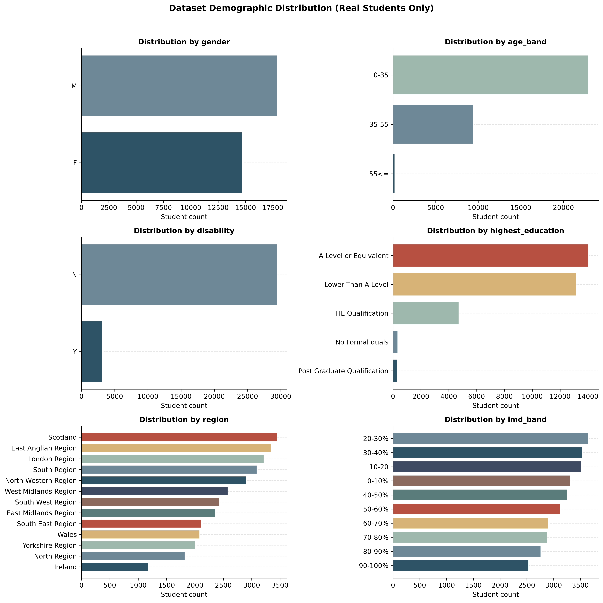
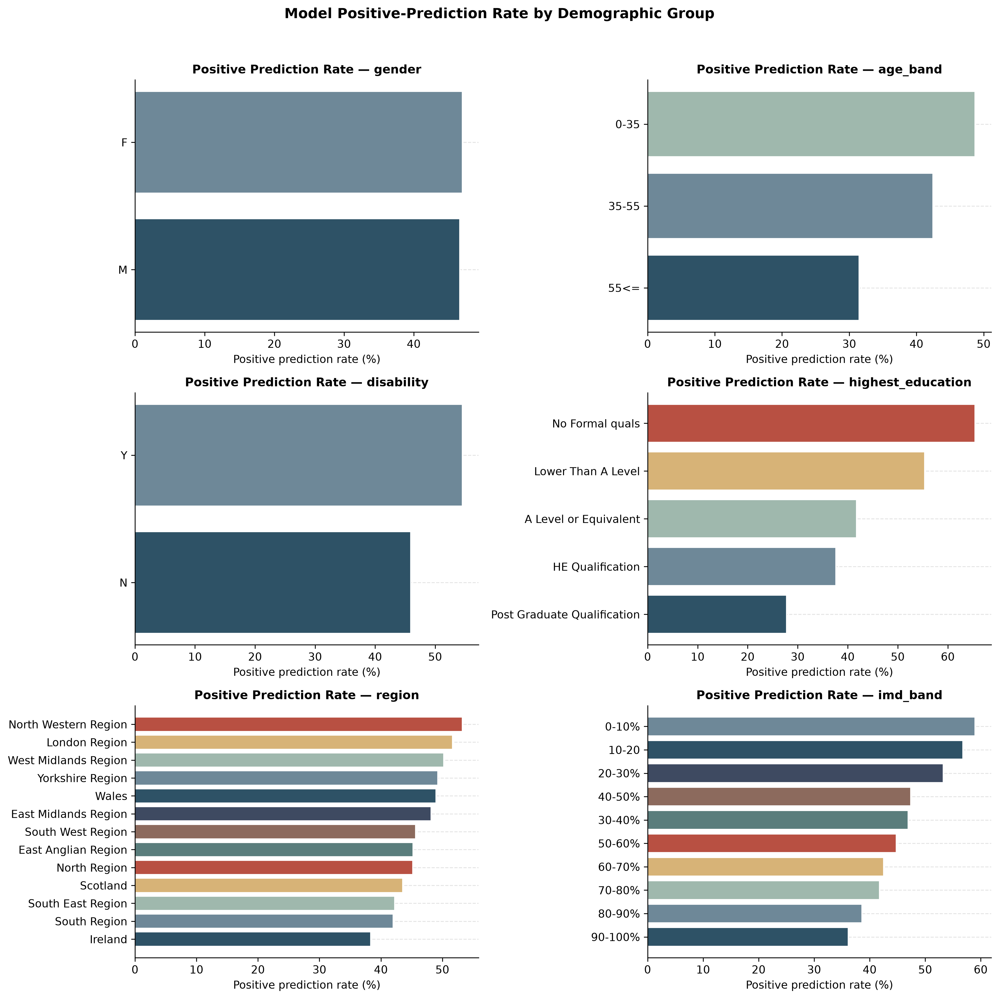
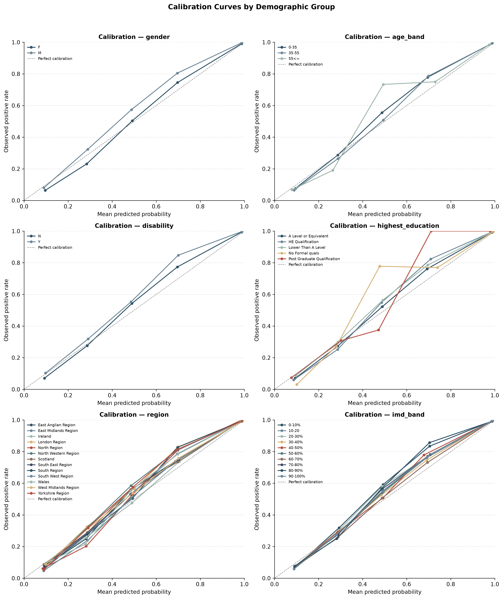
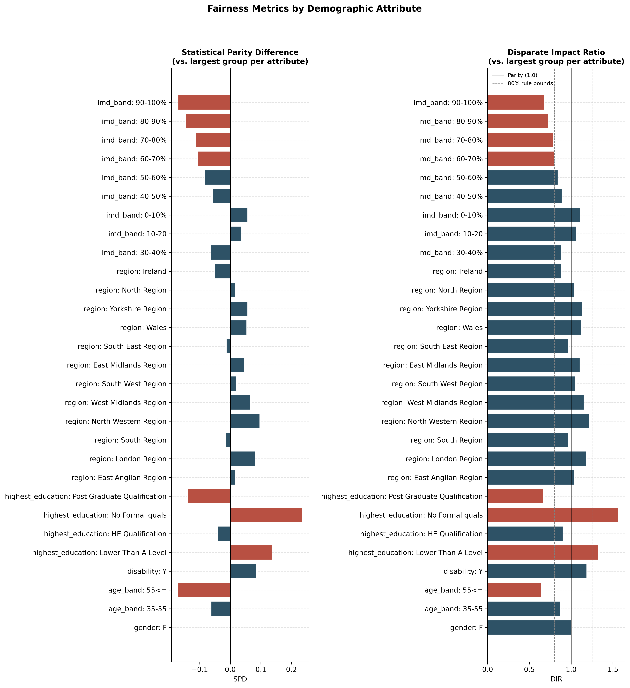

# Ethics and Fairness Evaluation Report
## Academic Risk Prediction System (Frozen XGBoost Model)

*Generated automatically on 2026-07-02 10:21:34 by `ethics_fairness.py`. All figures and tables in this report are produced directly from real, observed data — no values in this report are estimated, simulated, or fabricated.*

## Executive Summary

**Key Findings**

- 6 real demographic attribute(s) evaluated (`gender, age_band, disability, highest_education, region, imd_band`)
- 35 demographic group(s) analyzed across those attributes
- 32593 of 32593 students scored by the frozen model (0 excluded due to missing values, no imputation performed)
- 29 group-vs-reference fairness comparison(s) computed
- 8 four-fifths-rule fairness flag(s) detected
- Overall predicted positive rate: 0.468 | Overall observed true positive rate: 0.528 | Overall accuracy: 0.901
- No retraining performed — the frozen `.pkl` model was used strictly in inference mode (`predict_proba` only, `.fit()` never called)
- Model input features used (auto-detected from the model where available): `total_clicks, avg_score, active_days, engagement_variability, inactivity_days, engagement_slope, assessment_consistency`

## 1. Objective

This report presents a post-hoc ethics and fairness audit of the frozen academic risk prediction model (`academic_risk_xgboost.pkl`). The objective is to determine whether the model's predictions differ systematically across real demographic subgroups present in the student population, and whether such differences raise fairness concerns that warrant mitigation before the model is used to inform student support interventions. The model itself is not modified, retrained, or fine-tuned as part of this evaluation; it is used strictly in inference mode against the frozen artifact provided.

## 2. Methodology

- **Model artifact:** `..\academic_risk_xgboost.pkl` (loaded via `joblib.load`; `.fit()` is never called).
- **Dataset:** `..\final_student_psychology_dataset.csv` (32593 real student records).
- **Model input features (order as reported by the frozen model itself via `feature_names_in_`/booster metadata when available, otherwise the hardcoded fallback list):** `total_clicks, avg_score, active_days, engagement_variability, inactivity_days, engagement_slope, assessment_consistency`.
- **True label:** `psychological_risk` (1 = Withdrawn/Fail, 0 = otherwise).
- **Decision threshold:** predicted probability ≥ 0.5 → positive ("at risk") prediction, consistent with the deployed service.
- **Records scored:** 32593 of 32593 (0 excluded due to missing required feature/label values; no imputation was performed on excluded rows).
- **Demographic attribute detection:** the script scans the dataset for a candidate list of real demographic/protected attributes (`gender, age_band, disability, highest_education, region, imd_band`) and evaluates only those columns that actually exist in the data. No group is constructed or inferred; groups are exactly the distinct real values observed for each attribute.
- **Minimum group size for descriptive metrics:** 5 students. Groups below this size are reported by sample count only.
- **Minimum group size for fairness-ratio metrics (SPD / DIR):** 30 students in both the group and the reference group. This threshold guards against unstable ratios computed on small samples.
- **Reference group:** for each demographic attribute, the largest real group observed in the data is used as the reference for Statistical Parity Difference (SPD) and Disparate Impact Ratio (DIR). This is a data-driven choice, not an assumption about which group is 'privileged'; readers with domain-specific reference-group requirements should recompute against their chosen reference using the exported `group_statistics.csv`.
- **Calibration:** predicted probabilities are binned into 5 equal-width bins per group; within each bin, the mean predicted probability is compared to the observed (true) positive rate.
- **Equal Opportunity Difference (EOD) and False Positive Rate Difference (FPRD):** computed as the difference between a group's True/False Positive Rate and the reference group's, respectively. EOD requires positive true-label cases in both groups (TPR is undefined otherwise); FPRD requires negative true-label cases in both groups (FPR is undefined otherwise). Where either precondition fails, the metric is left blank and the reason is stated in the comparison's notes, per the constraint against estimating missing values.
- **Effect size:** Cohen's h is reported alongside SPD/DIR for each group comparison, using the standard proportion-difference formulation (2·arcsin(√p₁) − 2·arcsin(√p₂)) with conventional magnitude bands (negligible < 0.2, small < 0.5, medium < 0.8, large ≥ 0.8).
- **Uncertainty quantification:** 95% confidence intervals are computed via percentile bootstrap (1000 resamples, fixed seed 42 for reproducibility) for accuracy, precision, recall, F1, and positive-prediction-rate at the group level, and for SPD at the group-vs-reference comparison level. Bootstrap CIs are computed only for groups with at least 30 students; smaller groups report point estimates only, with this noted explicitly.

## 3. Dataset Demographics

The following real demographic attributes were detected and evaluated:

- **gender** (32593 non-missing records, 2 distinct group(s)): M (n=17875), F (n=14718)
- **age_band** (32593 non-missing records, 3 distinct group(s)): 0-35 (n=22944), 35-55 (n=9433), 55<= (n=216)
- **disability** (32593 non-missing records, 2 distinct group(s)): N (n=29429), Y (n=3164)
- **highest_education** (32593 non-missing records, 5 distinct group(s)): A Level or Equivalent (n=14045), Lower Than A Level (n=13158), HE Qualification (n=4730), No Formal quals (n=347), Post Graduate Qualification (n=313)
- **region** (32593 non-missing records, 13 distinct group(s)): Scotland (n=3446), East Anglian Region (n=3340), London Region (n=3216), South Region (n=3092), North Western Region (n=2906), West Midlands Region (n=2582), South West Region (n=2436), East Midlands Region (n=2365), South East Region (n=2111), Wales (n=2086), Yorkshire Region (n=2006), North Region (n=1823), Ireland (n=1184)
- **imd_band** (31482 non-missing records, 10 distinct group(s)): 20-30% (n=3654), 30-40% (n=3539), 10-20 (n=3516), 0-10% (n=3311), 40-50% (n=3256), 50-60% (n=3124), 60-70% (n=2905), 70-80% (n=2879), 80-90% (n=2762), 90-100% (n=2536)

All candidate demographic attributes were present in the dataset.

## 4. Group-wise Evaluation

Overall (all scored students, n=32593): predicted positive rate = 0.468, observed true positive rate = 0.528, accuracy = 0.901.

Full per-group metrics, including 95% bootstrap confidence intervals, are provided in `outputs/group_statistics.csv`. Summary below (accuracy and recall shown with their 95% bootstrap CI in brackets where computed, i.e. groups with n ≥ 30):

| Attribute | Group | N | Pos. Pred. Rate | Avg Pred. Prob. | Avg True Label | Accuracy [95% CI] | Precision | Recall [95% CI] | F1 |
|---|---|---|---|---|---|---|---|---|---|
| gender | M | 17875 | 0.466 | 0.525 | 0.538 | 0.893 [0.888, 0.897] | 0.962 | 0.833 [0.826, 0.840] | 0.893 |
| gender | F | 14718 | 0.470 | 0.531 | 0.516 | 0.911 [0.906, 0.915] | 0.954 | 0.869 [0.861, 0.876] | 0.909 |
| age_band | 0-35 | 22944 | 0.487 | 0.546 | 0.550 | 0.899 [0.895, 0.903] | 0.961 | 0.851 [0.844, 0.858] | 0.903 |
| age_band | 35-55 | 9433 | 0.424 | 0.486 | 0.478 | 0.905 [0.900, 0.911] | 0.952 | 0.844 [0.835, 0.855] | 0.895 |
| age_band | 55<= | 216 | 0.315 | 0.378 | 0.384 | 0.903 [0.861, 0.940] | 0.956 | 0.783 [0.691, 0.868] | 0.861 |
| disability | N | 29429 | 0.459 | 0.520 | 0.518 | 0.902 [0.898, 0.905] | 0.957 | 0.848 [0.843, 0.854] | 0.899 |
| disability | Y | 3164 | 0.545 | 0.600 | 0.619 | 0.893 [0.882, 0.903] | 0.969 | 0.854 [0.838, 0.869] | 0.908 |
| highest_education | A Level or Equivalent | 14045 | 0.417 | 0.485 | 0.480 | 0.898 [0.893, 0.903] | 0.952 | 0.828 [0.820, 0.838] | 0.886 |
| highest_education | Lower Than A Level | 13158 | 0.554 | 0.602 | 0.611 | 0.900 [0.895, 0.905] | 0.962 | 0.871 [0.863, 0.879] | 0.914 |
| highest_education | HE Qualification | 4730 | 0.376 | 0.446 | 0.438 | 0.909 [0.900, 0.917] | 0.962 | 0.826 [0.809, 0.843] | 0.889 |
| highest_education | No Formal quals | 347 | 0.654 | 0.699 | 0.703 | 0.922 [0.893, 0.951] | 0.978 | 0.910 [0.871, 0.945] | 0.943 |
| highest_education | Post Graduate Qualification | 313 | 0.278 | 0.343 | 0.345 | 0.907 [0.875, 0.936] | 0.954 | 0.769 [0.686, 0.844] | 0.851 |
| region | Scotland | 3446 | 0.436 | 0.501 | 0.510 | 0.891 [0.881, 0.902] | 0.961 | 0.820 [0.804, 0.839] | 0.885 |
| region | East Anglian Region | 3340 | 0.452 | 0.512 | 0.510 | 0.899 [0.888, 0.910] | 0.953 | 0.844 [0.827, 0.862] | 0.895 |
| region | London Region | 3216 | 0.516 | 0.567 | 0.576 | 0.897 [0.887, 0.908] | 0.958 | 0.859 [0.844, 0.875] | 0.906 |
| region | South Region | 3092 | 0.420 | 0.484 | 0.476 | 0.905 [0.895, 0.915] | 0.954 | 0.841 [0.822, 0.859] | 0.894 |
| region | North Western Region | 2906 | 0.532 | 0.588 | 0.598 | 0.899 [0.888, 0.909] | 0.967 | 0.861 [0.845, 0.876] | 0.911 |
| region | West Midlands Region | 2582 | 0.502 | 0.561 | 0.567 | 0.892 [0.880, 0.904] | 0.957 | 0.848 [0.829, 0.866] | 0.899 |
| region | South West Region | 2436 | 0.456 | 0.519 | 0.502 | 0.917 [0.905, 0.928] | 0.959 | 0.872 [0.853, 0.890] | 0.913 |
| region | East Midlands Region | 2365 | 0.482 | 0.543 | 0.543 | 0.901 [0.889, 0.913] | 0.961 | 0.853 [0.833, 0.871] | 0.904 |
| region | South East Region | 2111 | 0.423 | 0.485 | 0.485 | 0.898 [0.885, 0.912] | 0.953 | 0.830 [0.808, 0.854] | 0.887 |
| region | Wales | 2086 | 0.489 | 0.548 | 0.548 | 0.903 [0.890, 0.917] | 0.961 | 0.858 [0.836, 0.878] | 0.906 |
| region | Yorkshire Region | 2006 | 0.493 | 0.550 | 0.551 | 0.903 [0.890, 0.916] | 0.962 | 0.859 [0.838, 0.878] | 0.907 |
| region | North Region | 1823 | 0.452 | 0.502 | 0.495 | 0.923 [0.911, 0.935] | 0.962 | 0.879 [0.859, 0.899] | 0.919 |
| region | Ireland | 1184 | 0.383 | 0.460 | 0.451 | 0.883 [0.865, 0.901] | 0.936 | 0.796 [0.763, 0.827] | 0.860 |
| imd_band | 20-30% | 3654 | 0.533 | 0.586 | 0.593 | 0.903 [0.892, 0.912] | 0.965 | 0.867 [0.853, 0.881] | 0.914 |
| imd_band | 30-40% | 3539 | 0.469 | 0.529 | 0.531 | 0.896 [0.887, 0.906] | 0.955 | 0.844 [0.829, 0.862] | 0.896 |
| imd_band | 10-20 | 3516 | 0.568 | 0.612 | 0.614 | 0.907 [0.898, 0.917] | 0.959 | 0.887 [0.874, 0.899] | 0.922 |
| imd_band | 0-10% | 3311 | 0.590 | 0.636 | 0.648 | 0.901 [0.890, 0.910] | 0.966 | 0.878 [0.864, 0.891] | 0.920 |
| imd_band | 40-50% | 3256 | 0.474 | 0.534 | 0.534 | 0.897 [0.887, 0.908] | 0.955 | 0.848 [0.830, 0.864] | 0.898 |
| imd_band | 50-60% | 3124 | 0.448 | 0.512 | 0.512 | 0.898 [0.887, 0.909] | 0.958 | 0.838 [0.821, 0.856] | 0.894 |
| imd_band | 60-70% | 2905 | 0.425 | 0.490 | 0.481 | 0.904 [0.894, 0.915] | 0.952 | 0.842 [0.823, 0.860] | 0.894 |
| imd_band | 70-80% | 2879 | 0.418 | 0.483 | 0.485 | 0.895 [0.884, 0.907] | 0.954 | 0.822 [0.804, 0.843] | 0.883 |
| imd_band | 80-90% | 2762 | 0.386 | 0.460 | 0.459 | 0.898 [0.887, 0.909] | 0.963 | 0.809 [0.788, 0.831] | 0.880 |
| imd_band | 90-100% | 2536 | 0.362 | 0.431 | 0.425 | 0.901 [0.890, 0.914] | 0.951 | 0.810 [0.784, 0.835] | 0.875 |

## 5. Fairness Observations

Statistical Parity Difference (SPD), Disparate Impact Ratio (DIR), Equal Opportunity Difference (EOD), and False Positive Rate Difference (FPRD) were computed for demographic attributes with at least two groups meeting the minimum sample size (30). EOD and FPRD are computed only when the group and reference group both contain the relevant true-label class (positives for EOD, negatives for FPRD); where that precondition fails the cell is marked n/a and the reason is recorded in `outputs/fairness_metrics.csv`. SPD is additionally reported with its 95% bootstrap confidence interval and with Cohen's h as a standardized effect size. The U.S. EEOC "four-fifths rule" (DIR outside [0.8, 1.25]) is used purely as a descriptive flag, not as a legal or normative conclusion.

| Attribute | Reference (n) | Compared (n) | Ref. Pos. Rate | Compared Pos. Rate | SPD (95% CI) | Effect size (Cohen's h) | DIR | EOD | FPRD | Four-Fifths Flag |
|---|---|---|---|---|---|---|---|---|---|---|
| gender | M (17875) | F (14718) | 0.466 | 0.470 | 0.004 [-0.007, 0.014] | 0.007 (negligible) | 1.008 | 0.035 | 0.007 | no |
| age_band | 0-35 (22944) | 35-55 (9433) | 0.487 | 0.424 | -0.063 [-0.074, -0.051] | -0.126 (negligible) | 0.871 | -0.007 | -0.004 | no |
| age_band | 0-35 (22944) | 55<= (216) | 0.487 | 0.315 | -0.172 [-0.236, -0.106] | -0.353 (small) | 0.646 | -0.068 | -0.020 | YES |
| disability | N (29429) | Y (3164) | 0.459 | 0.545 | 0.086 [0.068, 0.104] | 0.172 (negligible) | 1.187 | 0.006 | 0.004 | no |
| highest_education | A Level or Equivalent (14045) | Lower Than A Level (13158) | 0.417 | 0.554 | 0.136 [0.125, 0.149] | 0.274 (small) | 1.327 | 0.043 | 0.015 | YES |
| highest_education | A Level or Equivalent (14045) | HE Qualification (4730) | 0.417 | 0.376 | -0.041 [-0.056, -0.027] | -0.084 (negligible) | 0.901 | -0.003 | -0.013 | no |
| highest_education | A Level or Equivalent (14045) | No Formal quals (347) | 0.417 | 0.654 | 0.237 [0.187, 0.288] | 0.479 (small) | 1.567 | 0.081 | 0.010 | YES |
| highest_education | A Level or Equivalent (14045) | Post Graduate Qualification (313) | 0.417 | 0.278 | -0.139 [-0.183, -0.087] | -0.294 (small) | 0.666 | -0.060 | -0.019 | YES |
| region | Scotland (3446) | East Anglian Region (3340) | 0.436 | 0.452 | 0.017 [-0.008, 0.040] | 0.033 (negligible) | 1.038 | 0.024 | 0.009 | no |
| region | Scotland (3446) | London Region (3216) | 0.436 | 0.516 | 0.081 [0.057, 0.104] | 0.162 (negligible) | 1.186 | 0.038 | 0.016 | no |
| region | Scotland (3446) | South Region (3092) | 0.436 | 0.420 | -0.016 [-0.039, 0.007] | -0.032 (negligible) | 0.964 | 0.021 | 0.003 | no |
| region | Scotland (3446) | North Western Region (2906) | 0.436 | 0.532 | 0.097 [0.071, 0.120] | 0.194 (negligible) | 1.222 | 0.040 | 0.009 | no |
| region | Scotland (3446) | West Midlands Region (2582) | 0.436 | 0.502 | 0.067 [0.040, 0.092] | 0.134 (negligible) | 1.153 | 0.027 | 0.016 | no |
| region | Scotland (3446) | South West Region (2436) | 0.436 | 0.456 | 0.021 [-0.006, 0.047] | 0.042 (negligible) | 1.048 | 0.051 | 0.004 | no |
| region | Scotland (3446) | East Midlands Region (2365) | 0.436 | 0.482 | 0.046 [0.021, 0.072] | 0.092 (negligible) | 1.106 | 0.032 | 0.006 | no |
| region | Scotland (3446) | South East Region (2111) | 0.436 | 0.423 | -0.013 [-0.040, 0.014] | -0.026 (negligible) | 0.970 | 0.010 | 0.004 | no |
| region | Scotland (3446) | Wales (2086) | 0.436 | 0.489 | 0.054 [0.026, 0.081] | 0.108 (negligible) | 1.124 | 0.037 | 0.008 | no |
| region | Scotland (3446) | Yorkshire Region (2006) | 0.436 | 0.493 | 0.057 [0.030, 0.083] | 0.114 (negligible) | 1.131 | 0.039 | 0.008 | no |
| region | Scotland (3446) | North Region (1823) | 0.436 | 0.452 | 0.016 [-0.012, 0.046] | 0.033 (negligible) | 1.038 | 0.059 | -0.001 | no |
| region | Scotland (3446) | Ireland (1184) | 0.436 | 0.383 | -0.052 [-0.084, -0.020] | -0.106 (negligible) | 0.880 | -0.024 | 0.010 | no |
| imd_band | 20-30% (3654) | 30-40% (3539) | 0.533 | 0.469 | -0.063 [-0.088, -0.039] | -0.127 (negligible) | 0.881 | -0.023 | -0.000 | no |
| imd_band | 20-30% (3654) | 10-20 (3516) | 0.533 | 0.568 | 0.035 [0.012, 0.056] | 0.071 (negligible) | 1.066 | 0.019 | 0.015 | no |
| imd_band | 20-30% (3654) | 0-10% (3311) | 0.533 | 0.590 | 0.057 [0.034, 0.079] | 0.115 (negligible) | 1.107 | 0.011 | 0.012 | no |
| imd_band | 20-30% (3654) | 40-50% (3256) | 0.533 | 0.474 | -0.059 [-0.082, -0.034] | -0.117 (negligible) | 0.890 | -0.020 | -0.000 | no |
| imd_band | 20-30% (3654) | 50-60% (3124) | 0.533 | 0.448 | -0.085 [-0.107, -0.060] | -0.170 (negligible) | 0.841 | -0.030 | -0.007 | no |
| imd_band | 20-30% (3654) | 60-70% (2905) | 0.533 | 0.425 | -0.107 [-0.132, -0.083] | -0.215 (small) | 0.798 | -0.026 | -0.007 | YES |
| imd_band | 20-30% (3654) | 70-80% (2879) | 0.533 | 0.418 | -0.115 [-0.139, -0.092] | -0.230 (small) | 0.785 | -0.045 | -0.009 | YES |
| imd_band | 20-30% (3654) | 80-90% (2762) | 0.533 | 0.386 | -0.147 [-0.171, -0.122] | -0.295 (small) | 0.725 | -0.058 | -0.020 | YES |
| imd_band | 20-30% (3654) | 90-100% (2536) | 0.533 | 0.362 | -0.171 [-0.198, -0.145] | -0.346 (small) | 0.679 | -0.058 | -0.015 | YES |

**Observed finding:** 8 group comparison(s) fall outside the four-fifths rule bounds, indicating a materially different positive-prediction rate relative to the reference group for that attribute. The largest observed effect size in this run was for `highest_education: No Formal quals` vs. reference `A Level or Equivalent` (SPD = 0.237, 23.7 percentage points; DIR = 1.567; Cohen's h = 0.479, small effect). This is an observed statistical pattern in the current data and model; it does not by itself establish the cause (e.g., it could reflect genuine differences in the engineered engagement/performance features between groups, historical outcome disparities encoded in the training labels, or model bias). Attributing a specific cause would require further investigation and is not asserted here.

## 6. Limitations

- **Label bias:** the true label (`psychological_risk`) is a proxy derived from `final_result` (Withdrawn/Fail), not a clinical psychological assessment. Any disparity observed reflects disparities in this academic-outcome proxy, not a validated psychological construct.
- **Reference-group sensitivity:** SPD and DIR values depend on the choice of reference group (here, the largest observed group per attribute). Different reference choices can change which comparisons are flagged.
- **Single fairness threshold:** only the default 0.5 probability threshold was evaluated. Fairness metrics can shift materially at other operating thresholds.
- **No causal claims:** this audit is observational. It reports statistical association between demographic attributes and model outputs; it does not establish that any attribute *causes* differences in predictions.
- **Intersectionality not evaluated:** groups are analyzed one attribute at a time. Intersectional subgroups (e.g., gender × disability) were not evaluated in this run and may show different patterns than single-attribute groups.
- **Small-sample groups:** groups below the minimum thresholds are reported with sample counts only, or excluded from ratio metrics, to avoid presenting statistically unreliable figures; this means some real groups have incomplete reporting in this audit.
- **Static, single-snapshot audit:** this evaluation reflects the frozen model and the dataset snapshot at the time of the run. It does not assess drift over time or across future cohorts.

## 7. Ethical Considerations

- Academic risk predictions of this kind can influence how institutional resources (advising, outreach, interventions) are allocated to students. Systematic disparities in positive-prediction rates across demographic groups could result in unequal access to support, regardless of intent.
- Because the true label is an academic-outcome proxy rather than a clinical measure, labeling students as psychologically "at risk" on this basis alone carries a risk of mislabeling and should be treated as one input among several in any human decision process, not an automated determination.
- Disability status and other sensitive attributes evaluated here are protected characteristics in many jurisdictions' education and anti-discrimination law; any operational use of this model should involve institutional ethics/legal review in addition to this technical audit.
- Transparency to affected students about the existence and basis of automated risk scoring, and a mechanism for human review/appeal, are standard responsible-AI practices relevant to this type of system.

## 8. Recommendations

**Based on observed findings in this run:**
- Review the specific attribute/group comparisons flagged in Section 5 with subject-matter and ethics stakeholders before relying on this model's output for those groups.
- Report group-wise metrics (Section 4) alongside overall accuracy whenever this model's outputs are used in decision-making, rather than relying on aggregate accuracy alone.

**Proposed future work (not performed in this audit):**
- Evaluate additional fairness definitions not covered by this run's SPD, DIR, EOD, and FPRD metrics — e.g., full equalized odds testing, formal statistical significance testing (chi-square / Fisher's exact) for each group comparison, and per-group Expected Calibration Error.
- Evaluate intersectional subgroups where sample sizes permit.
- If disparities are confirmed and judged unacceptable by institutional stakeholders, consider bias-mitigation approaches (e.g., threshold adjustment per group, reweighting at retraining time, or feature audit) — any such change would require retraining and is out of scope for this frozen-model audit.
- Extend this audit to future data snapshots to monitor for fairness drift over time.

---
*This report was generated entirely from real data and the frozen model's actual predictions. No group, metric, or conclusion in this report is fabricated or estimated. Where a metric could not be validly computed, this is stated explicitly rather than approximated.*