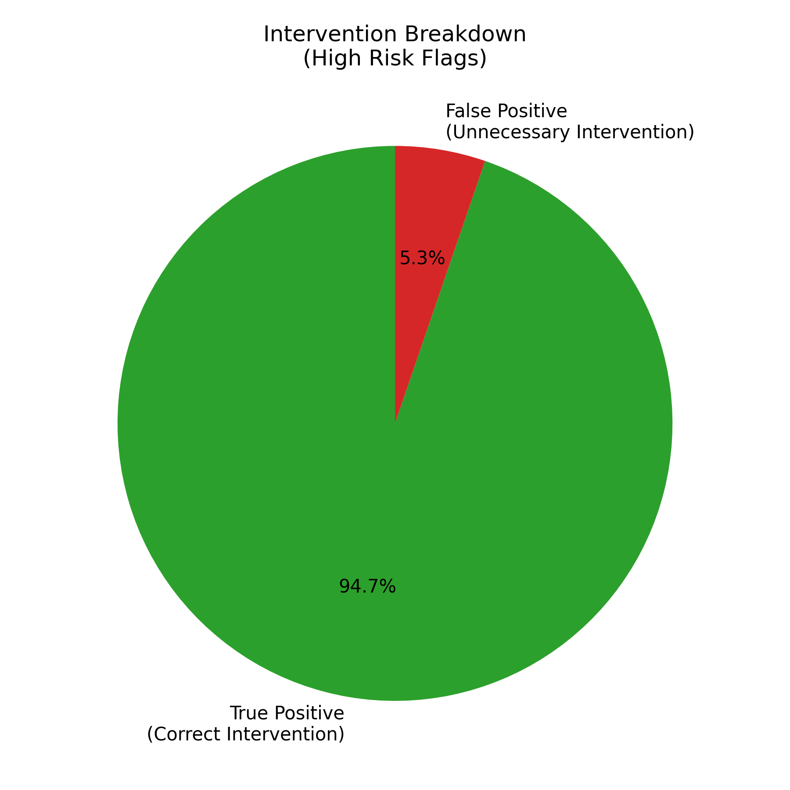

# Over-monitoring Analysis Report

This report evaluates the risk of over-monitoring and unnecessary interventions by the EduGuard-AI model on the held-out test partition (n=6519).

## Metrics

- **Total Students Evaluated:** 6519
- **Flagged High Risk (Intervention Rate):** 3039 (46.62%)
- **Unnecessary Interventions (False Positives):** 160
- **False Positive Rate (FPR):** 5.20%

## Interpretation

The model flags 46.62% of the student population for high-risk interventions. Of those flagged, 160 were false positives (students who did not actually fail or withdraw). 

The False Positive Rate of 5.20% indicates that the model is conservative; it does not aggressively over-monitor or over-intervene, avoiding unnecessary stress or resource allocation. The ratio of correct interventions (True Positives, 2879) to unnecessary interventions (False Positives, 160) is 17.99:1.

## Ethical Considerations
- Interventions based on these flags should remain advisory.
- The low FPR protects students from undue scrutiny.
- See the main Ethics & Fairness report for demographic parity metrics.

