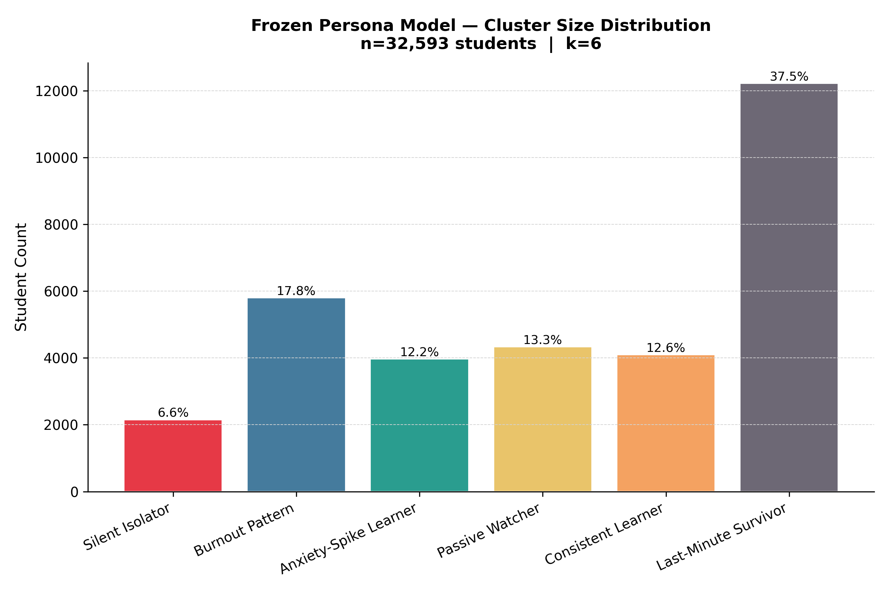
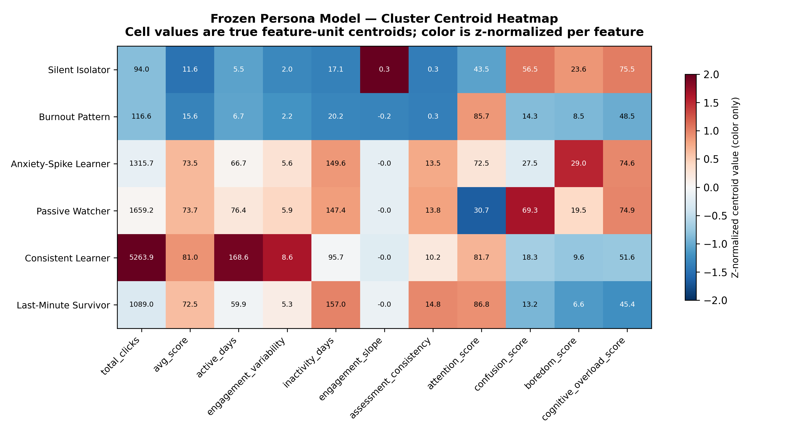
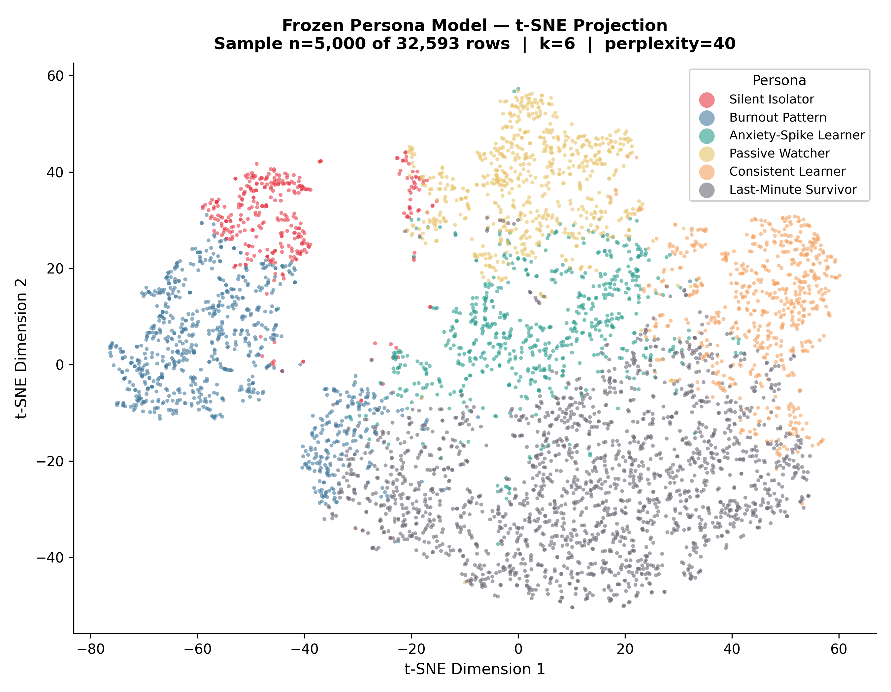

# EduGuard AI — Persona Model External Validation Report

## Purpose
This report validates the **frozen, deployed** persona clustering artifacts (`persona_scaler.pkl`, `persona_kmeans.pkl`) exactly as they are used in production by `advanced_persona_engine.py`. No model was trained, fitted, or re-fitted as part of this validation. Only `.transform()` and `.predict()` were called on the frozen objects.

## Dataset
- Source: `advanced_persona_profiles.csv`
- Shape: 32,593 rows x 28 columns
- Feature columns used (must match training order exactly): `total_clicks, avg_score, active_days, engagement_variability, inactivity_days, engagement_slope, assessment_consistency, attention_score, confusion_score, boredom_score, cognitive_overload_score`

## 1. Prediction Consistency Check
The frozen scaler and frozen KMeans model were re-applied to the feature columns of `advanced_persona_profiles.csv` via `scaler.transform()` followed by `kmeans.predict()`. The resulting cluster assignments were compared row-by-row against the `persona_cluster` column already stored in the CSV.

- Total rows evaluated: **32,593**
- Exact matches: **32,593**
- Mismatches: **0**
- Match rate: **100.000000%**

**Verdict:** PASS — predictions from the frozen model exactly reproduce the stored `persona_cluster` column.

Full row-level detail: `outputs/prediction_consistency.csv`.

## 2. Validation Metrics (Frozen Cluster Assignments)
These metrics are computed directly on the frozen model's cluster labels and the scaler-transformed feature matrix. They measure the *current* quality of the deployed clustering, not a newly trained one.

| Metric | Value | Notes |
|---|---|---|
| Silhouette Score | 0.2364 | Computed on a random subsample of 8,000 rows (silhouette is O(n²); full-dataset computation is infeasible) |
| Davies-Bouldin Index | 1.4289 | Computed on the full dataset (n=32,593); lower is better |
| Calinski-Harabasz Index | 6407.0340 | Computed on the full dataset (n=32,593); higher is better |

Raw values: `outputs/persona_validation_metrics.csv`.

## 3. Cluster Size Distribution

|   cluster_id | persona               |   count |   percentage |
|-------------:|:----------------------|--------:|-------------:|
|            0 | Silent Isolator       |    2154 |         6.61 |
|            1 | Burnout Pattern       |    5805 |        17.81 |
|            2 | Anxiety-Spike Learner |    3973 |        12.19 |
|            3 | Passive Watcher       |    4334 |        13.3  |
|            4 | Consistent Learner    |    4102 |        12.59 |
|            5 | Last-Minute Survivor  |   12225 |        37.51 |

Raw values: `outputs/cluster_sizes.csv`.

## 4. Cluster Centroids
Centroids below are the frozen `kmeans.cluster_centers_` values, inverse-transformed back into original feature units via the frozen scaler for interpretability.

|   cluster_id | persona               |   total_clicks |   avg_score |   active_days |   engagement_variability |   inactivity_days |   engagement_slope |   assessment_consistency |   attention_score |   confusion_score |   boredom_score |   cognitive_overload_score |
|-------------:|:----------------------|---------------:|------------:|--------------:|-------------------------:|------------------:|-------------------:|-------------------------:|------------------:|------------------:|----------------:|---------------------------:|
|            0 | Silent Isolator       |         93.97  |      11.603 |         5.502 |                    2.035 |            17.057 |              0.29  |                    0.265 |            43.486 |            56.514 |          23.608 |                     75.483 |
|            1 | Burnout Pattern       |        116.636 |      15.641 |         6.674 |                    2.223 |            20.162 |             -0.174 |                    0.313 |            85.733 |            14.267 |           8.514 |                     48.493 |
|            2 | Anxiety-Spike Learner |       1315.69  |      73.473 |        66.664 |                    5.588 |           149.635 |             -0.015 |                   13.509 |            72.544 |            27.456 |          29.014 |                     74.566 |
|            3 | Passive Watcher       |       1659.23  |      73.746 |        76.361 |                    5.87  |           147.429 |             -0.015 |                   13.835 |            30.659 |            69.341 |          19.471 |                     74.876 |
|            4 | Consistent Learner    |       5263.88  |      81.033 |       168.635 |                    8.615 |            95.716 |             -0.024 |                   10.156 |            81.7   |            18.3   |           9.595 |                     51.576 |
|            5 | Last-Minute Survivor  |       1088.95  |      72.532 |        59.861 |                    5.283 |           156.997 |             -0.008 |                   14.808 |            86.815 |            13.185 |           6.561 |                     45.407 |

Raw values: `outputs/cluster_centroids.csv`.

## 5. Cluster Structure Visualization

### t-SNE Projection

### UMAP Projection
**UMAP projection was not generated.** The `umap-learn` package is not installed in the environment this script ran in. Install it with `pip install umap-learn --break-system-packages` and re-run this script to produce `persona_umap.png`.

## 6. On Random-Seed Stability (Scope Note)
This report deliberately does **not** perform multi-seed retraining or report random-seed stability metrics (e.g., Adjusted Rand Index across seeds). `persona_kmeans.pkl` is a single, already-fitted, deployed model — it has one fixed set of cluster centers and was fit with one specific random seed at training time. Asking "how stable is this frozen model across different seeds" is not a well-formed question, because a frozen model cannot be re-seeded without becoming a different model.

Random-seed / multi-seed robustness is a property of the **training procedure**, not of a specific deployed artifact. That question is addressed separately by `section_g_clustering_validation.py`, which re-runs K-Means from scratch across 20 seeds on the training dataset to characterize how sensitive the clustering *methodology* is to initialization. That script is a distinct, complementary experiment and is not modified, re-run, or reproduced by this validation script.

## Summary
- Prediction consistency: PASS
- Silhouette / Davies-Bouldin / Calinski-Harabasz computed directly from the frozen deployed model, no synthetic or fabricated values.
- This validation confirms whether the persona engine **currently deployed** in EduGuard AI behaves as documented against the shipped reference dataset.
